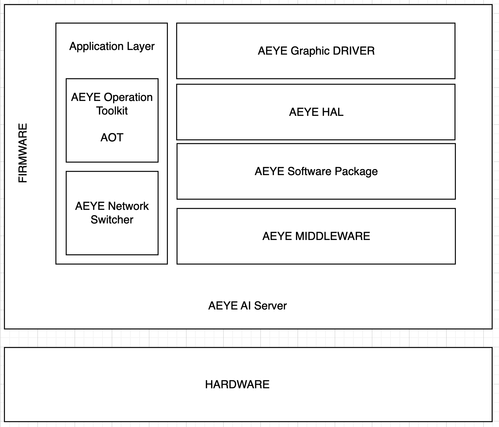

## AEYE 안저 질환 탐지 서비스

2024년도 한국정보산업연합회의 지원을 받아 한이음 프로젝트에 참여하여 개발한 AI 안저 질환 탐지 서비스입니다.

FrontEnd : [김경서](https://github.com/Gyeongse0) \
DataBase : [박지원](https://github.com/jiw3026) \
BackEnd : [정윤철](https://github.com/Yoonchulchung)

2024년 3월 ~ 2024년 8월까지 진행한 프로젝트입니다. 

통합된 리포지토리입니다 : [AEYE](https://github.com/2024-Hanium-A-EYE/AEYE) | [AEYE WEB](https://github.com/2024-Hanium-A-EYE/AEYE-WEB)     

세부 리포지토리 :     
- Next.js를 활용하여 AEYE 프로젝트의 웹 페이지를 제작하였습니다                  : [FrontEnd](https://github.com/2024-Hanium-A-EYE/AEYE-FE)
- Django 를 활용하여 AEYE 프로젝트의 웹 벡엔드를 제작하였습니다                  :[Web BackEnd](https://github.com/2024-Hanium-A-EYE/AEYE_Router)
- Django, Flask, Tensorflow를 활용하여 AEYE 프로젝트의 AI 서버를 제작하였습니다 :[AI](https://github.com/2024-Hanium-A-EYE/AEYE_AI)
- Djaongo를 활용하여 AEYE 프로젝트를 모니터링하는 서버를 제작하였습니다            :[Maintainer](https://github.com/2024-Hanium-A-EYE/AEYE_Maintainer)
- 

Docker를 이용하여 서비스를 운영중인 환경에 영향 없이 AEYE 프로젝트가 동작할 수 있도록 설계되어 있습니다. 본 프로젝트는 AWS EC2 인스턴스 내부에서 서비스 운영을 했으며, 테라폼을 이용하여 AWS EC2 인스턴스 생성 관리를 하였습니다.     

AI 모델은 Tensorflow가 사용되었으며, AI가 추론한 데이터를 기반으로 GPT를 활용하여 진단에 도움이 되도록 설계했습니다. WEB Server와 AI Server는 다음과 같은 프레임워크를 기반으로 설계되어 있습니다.    

AEYE 프로젝트 전체 프레임워크:     

  

AEYE 프로젝트 WEB 서버:     

  

AEYE 프로젝트 AI 서버:     

  

AEYE 프로젝트 모니터링 서버:     

  

<!--

**Here are some ideas to get you started:**

🙋‍♀️ A short introduction - what is your organization all about?
🌈 Contribution guidelines - how can the community get involved?
👩‍💻 Useful resources - where can the community find your docs? Is there anything else the community should know?
🍿 Fun facts - what does your team eat for breakfast?
🧙 Remember, you can do mighty things with the power of [Markdown](https://docs.github.com/github/writing-on-github/getting-started-with-writing-and-formatting-on-github/basic-writing-and-formatting-syntax)
-->
